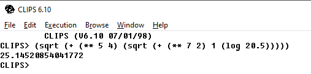

# CLIPS 1-4

## Задания

------
### Задание 1
В режиме командной строки вычислить значения выражений: 

  

----
### Задание 2

2.	В режиме командной строки создать три упорядоченных факта вида (poezd <номер> <пункт_назначения> <время_отправления>) с помощью конструк-тора deffacts. Добавить два новых факта, используя функцию  assert. Просмотреть полученный список фактов.  Удалить факты с индексами 1,4. В фактах с индексами 2, 3 изменить время отправления. 

3.	В режиме командной строки создать список из 4-х упорядоченных фактов вида: (sotrudnik <fio> <otdel>). Просмотреть полученный список. Изменить список фактов следующим образом: а) удалить факт f-1; б)изменить в  факте f-3 значение <fio>

----
### Задание 3

* Создать файл, содержащий три неупорядоченных факта вида  (client (name <фамилия>) (in <инд.номер>) (citi <город проживания>)).  Значений слота citi задать по умолчанию. Загрузить данные факты. В факте с индексом 1 изменить значение слота citi, а  в факте с индексом 2 изменить фамилию. Факт f-3  продублировать, изменив in. Сохранить полученный список фактов. 
* Загрузить полученный список фактов. Добавить 2 новых неупорядоченных факта вида, используя функцию  assert. Удалить  факты с индексами 1, 3, Просмотреть полученный результат. Сохранить полученный список фактов в другой файл.

-------
### Задание 4

С  помощью  deffacts создайте список из 5 упорядоченных фактов вида: `(sotrudnik <фамилия> <стаж работы> <кол-во детей> <оклад>)`
Определите следующие  правила:

1. начисления премии тем сотрудникам, у которых стаж работы не менее 5 лет или более 2-х детей. В результате выполнения правила должны быть добавлены факты вида: `(premia < фамилия > <сумма премии>)`. Премия вычисляется в  размере 20% от оклада. 
2. Определяющее,  все ли сотрудники получили премию. В результате выполнения правила должно выводиться соответствующее сообщение.
3. Определяющее, есть ли среди сотрудников ветераны труда ( ветераном труда считается сотрудник, у которого стаж работы более 20 лет). В результате выполнения правила должно выводиться соответствующее сообщение.

## Варианты заданий

* 1 задание - c, e, h 
* 2 задание - 2, 3 
* 3 задание - 1 
* 4 задание - 1

## Решения

----
### Задание 1

  

-----
### Задание 2

-------
### Задание 3

------
### Задание 4

