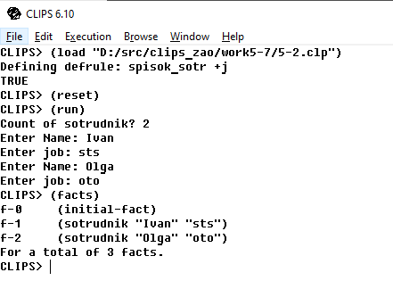
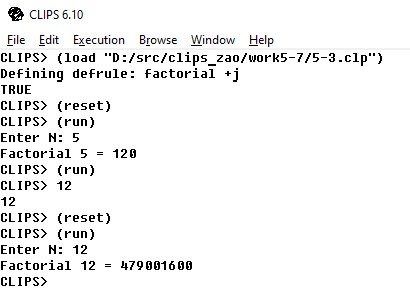
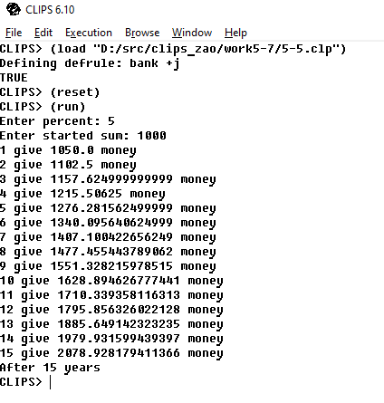
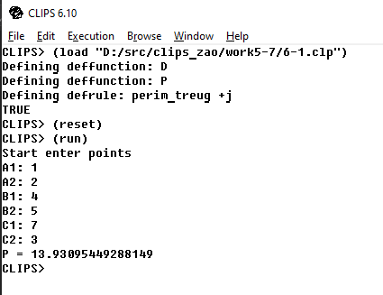
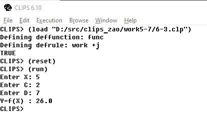
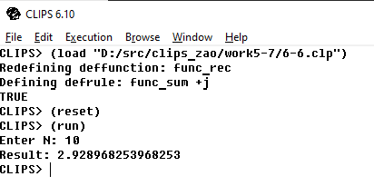
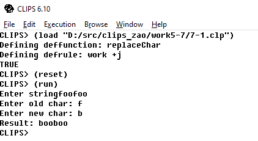
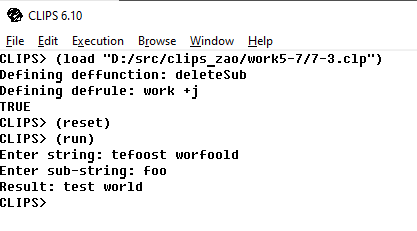
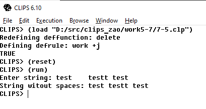

# CLIPS 5-7

## Задания

---------
### Задание 5

1. Создать правило spisok_sotr, которое запрашивает количество сотрудни-ков, вводит ФИО и должность каждого и добавляет факты вида (sotrudnik  <фамилия >  <должность > ).
2. Создать правило factorial для вычисления n!
3. Первоначальная сумма вклада в банк составляет S0 руб., процентная ставка – р% годовых. Через сколько лет сумма вклада более чем в 2 раза превысит первоначальную? Создать соответствующее правило

-------
### Задание 6

1. Создать функцию для вычисления длины отрезка по заданным координатам его концов (a1, a2) и (b1, b2). 
Используя данную функцию найти периметр треугольника по координатам его вершин.
2. Определить функцию для вычисления значения Y =f(X) с выбором формулы в соответствии с условием
3. Создайте рекурсивную функцию для вычисления суммы вида 

-----
### Задание 7

1. Создайте  правило, заменяющее в строке один указанный символ другим
2. Создайте  правило, удаляющее из заданной строки все вхождения указан-ной подстроки
3. Создайте  функцию, позволяющую удалить из строки лишние пробелы, оставив по одному между словами. 

## Варианты заданий

* 5 задание - 2, 3, 5
* 6 задание - 1, 3, 6
* 7 задание - 1, 3, 5

## Решения

---------
### Задание 5

[Код приложения](5-2.clp)

[Код приложения](5-3.clp)

[Код приложения](5-5.clp)

-------
### Задание 6

[Код приложения](6-1.clp)

[Код приложения](6-3.clp)

[Код приложения](6-6.clp)

-----
### Задание 7

[Код приложения](7-1.clp)

[Код приложения](7-3.clp)

[Код приложения](7-5.clp)

